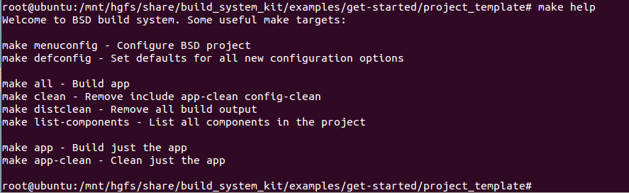

## About this repository
an app for using build_system_kit

## How to use?

	$cd ffmpeg_audio
    $./build_lib.sh
    
    $make menuconfig
    $source run_make.sh
    $source set_ffmpeg_environment.sh

    $./build/ffmpeg_audio Despacito-16666406.mp3
    
   
**Use the make help for more shell cmd:**

## More info for ffmpeg:
- [雷霄骅的博客](https://blog.csdn.net/leixiaohua1020)
- [FFmpeg官网](http://ffmpeg.org/documentation.html)
   

    

 

  